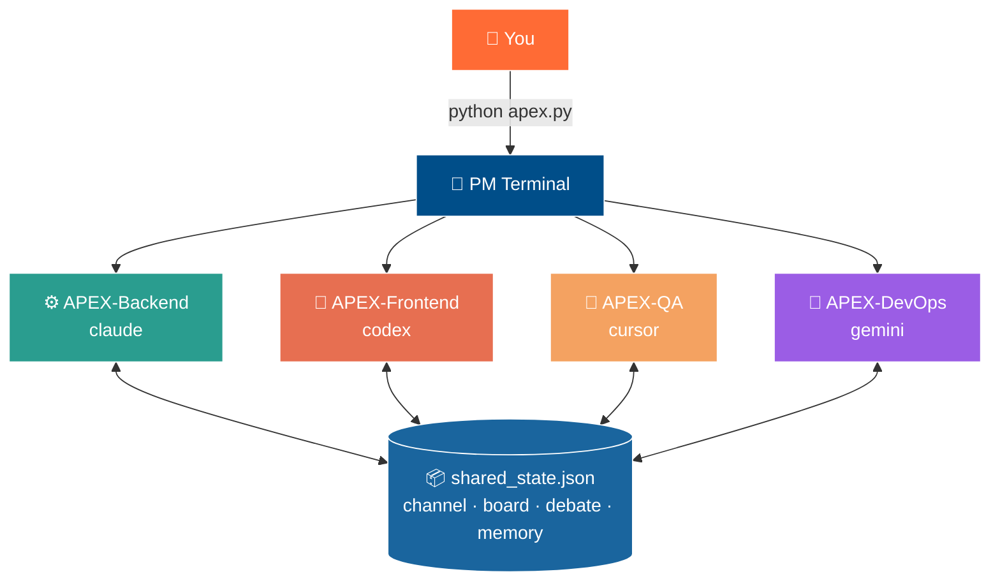

<div align="center">


<br />

```

   █████╗ ██████╗ ███████╗██╗  ██╗    ████████╗███████╗ █████╗ ███╗   ███╗
  ██╔══██╗██╔══██╗██╔════╝╚██╗██╔╝    ╚══██╔══╝██╔════╝██╔══██╗████╗ ████║
  ███████║██████╔╝█████╗   ╚███╔╝        ██║   █████╗  ███████║██╔████╔██║
  ██╔══██║██╔═══╝ ██╔══╝   ██╔██╗        ██║   ██╔══╝  ██╔══██║██║╚██╔╝██║
  ██║  ██║██║     ███████╗██╔╝ ██╗       ██║   ███████╗██║  ██║██║ ╚═╝ ██║
  ╚═╝  ╚═╝╚═╝     ╚══════╝╚═╝  ╚═╝       ╚═╝   ╚══════╝╚═╝  ╚═╝╚═╝     ╚═╝

```

### 🚀 The Self-Coordinating AI Engineering Team

**One terminal. One sentence. A full squad of AI specialists plans, codes, tests, and ships — autonomously.**

<br />

[](https://python.org)
[](https://nextjs.org)
[](https://fastapi.tiangolo.com)
[](https://github.com/anthropics/mcp)
[](LICENSE)

[]()
[]()
[]()
[]()
[]()

<br />

[**🎯 Quick Start**](#-installation) • [**📖 Docs**](FEATURES_GUIDE.md) • [**🤖 Agents**](#-meet-the-team) • [**🛠 Tools**](#-apex-intelligence-tools) • [**💬 Discord**]() • [**🐛 Issues**]()

---

</div>

## 🌟 What is APEX?

APEX is a **self-coordinating AI team system** — think of it as a project manager that hires, briefs, and supervises an entire engineering team of AI specialists, all running on your machine.

> You describe a goal. APEX opens a **Project Manager terminal** that automatically spawns specialist agent terminals (Backend, Frontend, QA, DevOps, Security…), divides the work, and drives everyone to completion — without you lifting another finger.

<div align="center">



</div>

Every agent shares one file-locked state file — they **post messages, pick up tasks, debate high-stakes decisions, and report progress in real-time** through a sleek **live web dashboard**.

---

## ✨ Why APEX?

<table>
<tr>
<td width="50%" valign="top">

### 🚀 **One-Command Magic**
```bash
python apex.py
```
Type a goal. Watch a team self-assemble.

### 🤖 **14 Specialist Agents**
Architect, Backend, Frontend, DBA, AI, QA, Security, DevOps, and more — each with a tailored persona.

### 🔀 **Mix Any CLI**
Claude Code, Codex, Gemini, Cursor — agents can each run on a different service.

### 🛠 **81 MCP Tools**
73 coordination tools + 8 intelligence tools on a single MCP server.

</td>
<td width="50%" valign="top">

### 🧠 **Smart Skill Routing**
Routes across **2,195+ skills** with cached, framework-correct prompts and 17 specialist personas.

### 🔍 **Deep Research Engine**
Integrated **Vibe-Research** engine powered by `claude-agent-sdk` for autonomous, fully-cited research in `subscription` mode without needing API keys.

### 📊 **Live Web Dashboard**
Next.js UI: task board, chat feed, agent roster, metrics, one-click team launch.

### 💬 **Structured Debate**
Propose → critique → revise → vote → judge. Gated to high-stakes decisions only.

### 💾 **Token-Efficient**
Compact shared summaries, padding-stripped prompts, smart rotation — 30-70% smaller.

</td>
</tr>
<tr>
<td width="50%" valign="top">

### 🔄 **Crash Recovery**
PM pings silent agents, recovers stale tasks, auto-backups every 15 writes.

</td>
<td width="50%" valign="top">

### 🔗 **Git-Safe + Notify**
Per-agent worktrees, conflict detection, task-to-commit linking. Slack/Discord/Teams webhooks on completion.

</td>
</tr>
</table>

---

## 🏗 Architecture

<div align="center">

```
╔═════════════════════════════════════════════════════════════════════╗
║                         APEX SYSTEM                                 ║
╠═════════════════════════════════════════════════════════════════════╣
║                                                                     ║
║   ┌──────────────┐    REST/WS    ┌──────────────────────────────┐   ║
║   │  Next.js 14  │◀────────────▶│  FastAPI · api_server.py     │   ║
║   │  Dashboard   │               │  POST /api/launch            │   ║
║   │  :8562       │               │  GET  /api/state             │   ║
║   └──────────────┘               │  WS   /ws/updates            │   ║
║                                  └──────────────┬───────────────┘   ║
║                                                 │                   ║
║                                         spawn_util.py               ║
║                                                 │                   ║
║              ┌──────────────────────────────────▼───────────────┐   ║
║              │            apex_v25.py  ·  MCP Server            │   ║
║              │   81 tools  · coordination + APEX intelligence   │   ║
║              │   team_coordinator.py  · base 73 tools           │   ║
║              └──────────────────┬───────────────────────────────┘   ║
║                                 │  shared_state.json                ║
║         ┌───────────────────────┼─────────────────────┐             ║
║         ▼                       ▼                     ▼             ║
║   ┌───────────┐          ┌────────────┐        ┌───────────┐        ║
║   │ APEX-PM   │          │ APEX-Agent │  ···   │ APEX-Agent│        ║
║   │ (any CLI) │          │ (any CLI)  │        │ (any CLI) │        ║
║   └───────────┘          └────────────┘        └───────────┘        ║
╚═════════════════════════════════════════════════════════════════════╝
```

</div>

| Layer | Role | What It Does |
|:---:|:---|:---|
| **L0** | 🪙 Token Discipline | Budget directive injected per task via `apex_token_budget` |
| **L1** | 🧠 Shared Brain | Write-once decisions; agents reload compact summaries (the big token saver) |
| **L2** | 🎯 Intelligence | Skill routing across 2,195+ skills + cached, padding-free prompts |
| **L3** | 🔀 Coordination | Live channel, task board, gated debate, auto-spawn, crash recovery |

---

## 📋 Prerequisites

Make sure you have these installed:

| Requirement | Version | Get It |
|:---|:---:|:---|
| 🐍 **Python** | 3.8+ | [python.org/downloads](https://python.org/downloads) |
| 📦 **Node.js** | 18+ | [nodejs.org](https://nodejs.org) *(for the web dashboard)* |
| 🤖 **At least one CLI** | latest | see below ⬇️ |

### Supported Agent CLIs

| CLI | Install Command | Provider |
|:---|:---|:---:|
| **Claude Code** | follow [Anthropic's guide](https://claude.ai/code) | Anthropic |
| **Codex CLI** | `npm install -g @openai/codex` | OpenAI |
| **Gemini CLI** | `npm install -g @google/gemini-cli` | Google |
| **Cursor Agent** | install from [cursor.sh](https://cursor.sh) | Cursor |

> 💡 You only need **one** CLI to get started. Mix them later for the full experience.

---

## 🚀 Installation

### 1️⃣ Clone the Repository

```bash
git clone https://github.com/VisalChathuranga/apex-multiagent-team.git
cd apex-team
```

### 2️⃣ Install Python Dependencies

```bash
pip install -r requirements.txt
```

### 3️⃣ Register the MCP Server

<table>
<tr>
<td>

**🍎 macOS / 🐧 Linux**
```bash
bash install.sh
```

</td>
<td>

**🪟 Windows (PowerShell)**
```powershell
./install.ps1
```

</td>
</tr>
</table>

The installer registers `apex_v25.py` globally with Claude Code and prints config snippets for Codex / Gemini / Cursor.

**✅ Verify the registration:**
```bash
claude mcp list
# Expected: "team" with 81 tools
```

<details>
<summary><b>🔧 Manual registration (if you skip the installer)</b></summary>

<br />

```bash
claude mcp add team -s user -- \
  env TEAM_STATE_FILE="$PWD/shared_state.json" \
      BRAIN_DIR="$PWD/second_brain" \
      APEX_ANTIGRAVITY_DIR="$HOME/.gemini/antigravity/skills" \
      APEX_CYBERSEC_DIR="$HOME/.gemini/cybersecurity-skills/skills" \
      MAX_AGENTS=4 MSG_ROTATE_LIMIT=800 \
  python "$PWD/apex_v25.py"
```

> Restart your CLI client after registering. For Codex / Cursor / Gemini, copy the ready-made config blocks from `examples/` — just replace `/ABS/PATH`.

</details>

<details>
<summary><b>🎁 Optional — Install skill libraries for full routing</b></summary>

<br />

```bash
# Antigravity skills (2,000+)
npx antigravity-awesome-skills          # → ~/.gemini/antigravity/skills

# Cybersecurity skills (195+)
git clone https://github.com/mukul975/Anthropic-Cybersecurity-Skills.git \
  ~/.gemini/cybersecurity-skills
```

> Without these, APEX falls back to a built-in keyword map — still fully functional, just less precise.

</details>

### 4️⃣ Set Up the Web Dashboard

```bash
cd frontend
npm install
npm run dev        # → http://localhost:8562
```

In a **second terminal**, start the API server:
```bash
# from the apex-team root
uvicorn api_server:app --host 0.0.0.0 --port 8561 --reload
```

---

## ▶️ Usage

### 🎨 Option A — Web Dashboard *(recommended)*

1. 🌐 Open **http://localhost:8562** in your browser
2. 🖱️ Click **Launch Team** in the top-right corner
3. 📝 Fill in the wizard:
   - **Goal** — describe what you want built
   - **Mode** — `ASK` (per-terminal CLI choice) or `SAME` (one CLI for all)
   - **CLI** — claude / codex / gemini / cursor
   - **Project Directory** — where to build *(blank = current dir)*
   - **Agents** — tick the checkboxes for the specialists you need
4. 🚀 Hit **Launch** — the PM terminal opens and the team self-assembles

<div align="center">


</div>

### 💻 Option B — Terminal

<table>
<tr>
<td width="50%" valign="top">

**🔀 ASK mode** — each agent picks its CLI
```bash
# macOS / Linux
./apex-ask.sh "Build a REST API with auth + React dashboard"

# Windows
apex-ask.bat "Build a REST API..."

# Direct
python apex.py --mode ask "..."
```

</td>
<td width="50%" valign="top">

**🎯 SAME mode** — all agents on one CLI
```bash
# macOS / Linux
./apex-same.sh --cli claude "..."

# Windows
apex-same.bat --cli claude "..."

# Direct
python apex.py --mode same --cli claude "..."
```

</td>
</tr>
</table>

**💬 Interactive mode** — guided step-by-step:
```bash
python apex.py
#  Command type — (1) ASK / (2) SAME : 1
#  What should the team build?       : Build a billing system
#  Project directory                 : ./my-project
#  PM CLI                            : claude
#  Worker roles                      : Backend,Frontend,QA
```

### 🎬 What Happens Automatically

```
1. 🎯 PM terminal opens on your chosen CLI
2. 🧠 PM joins the team, detects the stack, calls apex_orchestrate()
3. 🚀 apex_orchestrate() opens one terminal per agent role
4. 🤝 Every agent auto-joins, reads the goal, works the board
5. 📋 PM assigns tasks (by skill), monitors progress, runs debates on hard calls
6. ✅ When the board clears: export_report + webhook_notify "project complete"
```

---

## 🤖 Meet the Team

Select any combination at launch:

<table>
<tr>
<td width="33%" valign="top">

#### 🏛 **Design & Planning**
- 🏗 `architect` — C4 diagrams, ADRs, system design
- 📊 `analyst` — user stories, acceptance criteria, MVP scope
- 🔍 `researcher` — autonomous deep research, competitive analysis, and tech evaluations using `vibe-research`

#### 🛠 **Build**
- ⚙️ `backend` — Node / Go / Python / Rust / .NET
- 🎨 `frontend` — Next.js, React, Vue, SvelteKit, Astro
- 🗄 `dba` — schemas, migrations, indexes, query opt
- 🧠 `ai-integrator` — LLM, RAG, vector stores

</td>
<td width="33%" valign="top">

#### 🧪 **Quality**
- ✅ `tester` — pytest / jest / Playwright
- 👀 `reviewer` — SOLID, DRY, refactor suggestions
- ⚡ `perf-tuner` — profiling, N+1, bundle triage

#### 🛡 **Security** *(read-only)*
- 🔒 `security-auditor` — OWASP, CVEs, secrets
- 🎯 `pen-tester` — offensive testing
- 🚨 `dfir-analyst` — IR, Sigma / YARA detection

</td>
<td width="33%" valign="top">

#### 📚 **Ship**
- ✍️ `writer` — README, CHANGELOG, API docs
- 🚀 `devops` — CI/CD, Docker, Actions, Vercel / AWS

<br />

> 💡 **Pro tip:** Start small. Pick 3-4 agents for a focused build, then add specialists as needs emerge.

</td>
</tr>
</table>

---

## 🧰 APEX Intelligence Tools

The **8 brain tools** that make autonomy possible:

| Tool | What It Does |
|:---|:---|
| 🎯 `apex_orchestrate` | Record the goal + spawn the full worker team in one call |
| 🚀 `apex_spawn` | Open new terminal(s) for any role on any CLI, auto-joining the team |
| ⚡ `apex_build_prompt` ★ | Budget + shared context + persona + skills → optimised, cached prompt |
| 🔍 `apex_recommend_skills` | Scan 2,195+ skill catalogs; pick ≤ 5 for a role + task |
| 🎭 `apex_persona` | Specialist body + prompting framework for a given role |
| 🔎 `apex_detect_stack` | Polyglot stack detection (Next.js-priority frontend + backend lang) |
| 🪙 `apex_token_budget` | L0 budget directive for a task |
| 📊 `apex_status` | Show loaded catalogs, active personas, cache stats |
| 🔍 `apex_deep_research` | Trigger headless Vibe-Research jobs and save generated markdown reports |

Plus **74 base coordination tools**: `join_team`, `post_message`, `wait_for_message`, `add_task`, `assign_work`, `view_board`, `start_debate` / `judge_debate`, `save_summary` / `load_summary`, `report_finding`, `brain_add`, `start_dashboard`, `export_report`, … See [`FEATURES_GUIDE.md`](FEATURES_GUIDE.md) for the full reference.

---

## ⚙️ Configuration

Copy `config.example.env` → `.env` and adjust:

| Variable | Default | Description |
|:---|:---:|:---|
| `TEAM_STATE_FILE` | `./shared_state.json` | Shared state path *(must match across agents)* |
| `MAX_AGENTS` | `4` | Cap on concurrent live agents |
| `MSG_ROTATE_LIMIT` | `800` | Channel message rotation limit |
| `BACKUP_EVERY` | `15` | Auto-backup every N writes |
| `BACKUP_KEEP` | `10` | Number of backups to retain |
| `DASHBOARD_PORT` | `8765` | Legacy MCP dashboard port |
| `DASHBOARD_HOST` | `127.0.0.1` | Set `0.0.0.0` for LAN access |
| `APEX_CACHE_TTL` | `3600` | Prompt cache TTL in seconds |
| `APEX_PROMPT_ENGINEER` | `1` | Strip padding from prompts (30-70% smaller) |
| `WEBHOOK_URL` | *unset* | Slack / Discord / Teams webhook for completion |
| `OBSIDIAN_VAULT` | *unset* | Vault path for `obsidian_sync` |

---

## 🛡️ Safety Notes

> ⚠️ Agents run with `--dangerously-skip-permissions` so they work unattended.
> **Use only in trusted, non-production environments.**

- 🔧 Edit `_CLI_TEMPLATES` in `spawn_util.py` (or set `APEX_CLI_*` env vars) to re-enable confirmations
- 🌿 Ask the PM to *"use worktrees"* — `suggest_worktrees` gives each agent its own git branch
- 🚧 `MAX_AGENTS` guards against runaway spawning — raise it deliberately
- 🧪 Test without opening terminals: `APEX_SPAWN_DRYRUN=1`

---

## 🔧 Troubleshooting

<details>
<summary><b>🐛 Common Issues & Fixes</b></summary>

<br />

| Symptom | Fix |
|:---|:---|
| `claude: command not found` in spawned terminal | Install the CLI and ensure it's on PATH; restart |
| No new terminal opens on Linux | Install `gnome-terminal`, `konsole`, `xterm`, or `tmux` |
| `team` not listed / 0 tools after `claude mcp list` | Re-run installer; must point at `apex_v25.py`; restart client |
| Agents don't share tasks | All agents must use the **same** `TEAM_STATE_FILE` |
| `apex_recommend_skills` returns fallback only | Skill libraries not installed — set `APEX_ANTIGRAVITY_DIR` / `APEX_CYBERSEC_DIR` |
| Tokens spiking | Lower `MAX_AGENTS` and `MSG_ROTATE_LIMIT`; gate debate to hard decisions |
| Dashboard shows "Connecting…" | Start `api_server.py` on `:8561`; ensure `NEXT_PUBLIC_API_URL` matches |
| Frontend build errors | `cd frontend && npm install && npm run dev` |

</details>

---

## 📁 Project Structure

```
apex-team/
│
├── 🚀 apex.py                  # one-command launcher (--mode ask|same)
├── 📜 apex-ask.sh / .bat       # shortcut: ASK mode
├── 📜 apex-same.sh / .bat      # shortcut: SAME mode
│
├── 🧠 apex_v25.py              # MCP server: base + intelligence (81 tools)
├── 🔗 team_coordinator.py      # base coordination engine (73 tools)
├── 🪟 spawn_util.py            # cross-platform terminal spawning
├── 🤖 agent_boot.py            # runs inside each new terminal
├── 🌐 api_server.py            # FastAPI REST + WebSocket bridge
├── ⚡ launch_agent.py          # thin CLI wrapper with seed prompt
│
├── 🎨 frontend/                # Next.js 14 web dashboard
│   └── src/
│       ├── app/                # pages (page.tsx = main dashboard)
│       └── components/
│           ├── AgentPanel.tsx
│           ├── ChatPanel.tsx
│           ├── ControlsPanel.tsx
│           ├── LaunchWizard.tsx
│           └── TaskBoard.tsx
│
├── 📋 roles/                   # role playbooks
├── 🌱 seeds/                   # auto-generated seed prompts
├── 💾 second_brain/            # persistent brain notes
├── 📦 examples/                # MCP config snippets
│
├── 🛠 install.sh / .ps1        # one-shot installers
├── 📋 requirements.txt         # mcp, filelock, fastapi, uvicorn
├── ⚙️ config.example.env       # env template
│
├── 📖 FEATURES_GUIDE.md        # full reference for all 81 tools
├── 📝 CHANGELOG.md             # version history
└── 📄 LICENSE                  # MIT
```

---

## 🤝 Contributing

We love contributions! Here's the flow:

1. 🍴 **Fork** the repository
2. 🌿 Create a feature branch: `git checkout -b feature/my-feature`
3. ✏️ Commit your changes: `git commit -m "Add my feature"`
4. 📤 Push to the branch: `git push origin feature/my-feature`
5. 🎯 Open a **Pull Request**

> 💡 Keep PRs focused — one feature or fix per PR.

---

## 🙏 Credits

| Component | Author | License |
|:---|:---|:---:|
| 🔗 Base coordination server (`team_coordinator.py`) | **Shalinda Jayasinghe** — [Claude-Team-MCP](https://github.com/shalinda-j/Claude-Team-MCP) | MIT |
| 🧠 APEX intelligence + autonomy (`apex_v25.py`, `apex.py`, `spawn_util.py`) | Multi-Agent v2.5 framework | MIT |
| 🎨 Web dashboard (`frontend/`) | APEX Team project | MIT |

---

<div align="center">

### Released under the [**MIT License**](LICENSE)

<br />

**⭐ Star us on GitHub — it helps a lot!**

<br />

```

  ┌─────────────────────────────────────────────┐
  │                                             │
  │     Build autonomously. Ship confidently.   │
  │                                             │
  └─────────────────────────────────────────────┘

```

<sub>Made with 🧡 by the APEX Team · *Powered by MCP*</sub>

</div>